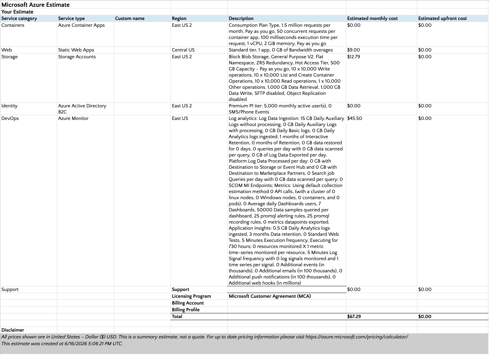

# Monthly Infrastructure Cost Analysis Report
### Target Environment: Secure Agentic RAG Demo (Mid-Sized Enterprise: 500–2,000 Employees)
**Profile Selected:** Tier 1 — Light Corporate Adoption (~1,000 queries per business day / 22,000 queries per month)

---

## Executive Summary
This report breaks down the baseline monthly operational costs for the **Secure Agentic RAG Architecture with Fine-Grained Authorization (FGA)**. By optimizing the architecture with a deterministic front-end guardrail, utilizing a cost-efficient LLM, and leveraging specialized cloud infrastructure plans, the entire deployment operates on a lean, budget-conscious footprint.

The total monthly operating expense is aggregated across the three pillars of the system: **Hosting & Infrastructure, Vector Database Storage, and LLM Token Consumption**.

```
                           MONTHLY COST DISTRIBUTION
    ┌───────────────────────────────────────────────┬────────────┐
    │ Hosting & Infrastructure (Azure Baseline)     │ $67.29     │
    ├───────────────────────────────────────────────┼────────────┤
    │ Vector DB Storage (Weaviate Cloud Flex Floor) │ $45.00     │
    ├───────────────────────────────────────────────┼────────────┤
    │ LLM Token Consumption (Gemini Flash Lite)     │ $8.58      │
    └───────────────────────────────────────────────┴────────────┘
    TOTAL ESTIMATED RUNTIME COMMITMENT: $120.87 / Month
```

---

## 1. Hosting & Infrastructure (Azure Baseline)
The frontend UI and secure API mesh are hosted on Azure utilizing serverless and edge-optimized services. This ensures maximum global availability and enterprise security with minimum fixed overhead.

* **Azure Static Web Apps (Standard Tier):** **$9.00 / month** Hosts the compiled Streamlit UI. Globally distributed via edge CDN networks, including native custom authentication hooks and enterprise identity provider integrations. Covers up to 100 GB of free data egress bandwidth.
* **Azure Storage Accounts (Standard Hot Blobs):** **$12.79 / month** Provides durable, zone-redundant storage (ZRS) for the raw document knowledge base and asset catalogs.
* **Azure Monitor (Log Analytics & Application Insights):** **$45.50 / month** Captures real-time telemetry, trace logs, and state shifts across the LangGraph network. Sized exactly at **0.5 GB per day** for log ingestion and **0.5 GB per day** for performance monitoring metrics, completely eliminating overage risk.
* **Microsoft Entra ID (Identity Layer):** **$0.00 / month** The B2C layer scales up to 50,000 Monthly Active Users (MAU) completely for free, fully absorbing the company's 500–2,000 employee seats.
* **Azure Container Apps (FastAPI Gateway & LangGraph Core):** **Variable / Metered** Billed on exact CPU/Memory allocation usage per execution millisecond. Scaled down to zero replicas during inactive hours.



**Hosting Subtotal:** **$67.29 / Month**

---

## 2. Vector DB Storage (Weaviate Cloud Flex)
Rather than hosting and maintaining local virtual machine servers, the database layer is deployed natively inside the **Weaviate Cloud Flex Plan**.

* **Plan Type:** Pay-as-you-go Month-to-Month Shared Cluster.
* **Included Features:** Multi-zone High Availability (HA), data redundancy, continuous automated 7-day snapshot back-ups, and native database Role-Based Access Control (RBAC).
* **Usage Mathematics:** Assuming a knowledge store of 20,000 corporate compliance documents broken down into roughly 100,000 total structural text blocks using 2,048-dimension OpenAI embeddings:
  $$	ext{100,000 chunks} 	imes 	ext{2,048 dimensions} = 	ext{204.8 Million dimensions stored}$$
  $$	ext{204.8 Million dimensions} 	imes \$0.00465 	ext{ rate per million} = \$0.95 	ext{ / month in raw asset consumption}$$
* **Billing Adjustments:** Because Weaviate enforces a mandatory baseline execution floor, your actual tiny data resource consumption ($0.95) is absorbed directly by the plan minimum. 

**Vector DB Subtotal:** **$45.00 / Month (Fixed Minimum Floor)**

---

## 3. LLM Token Consumption (Gemini Flash Lite)
Operational costs are highly insulated by routing queries through a multi-agent orchestration framework powered by the **`gemini-flash-lite-latest`** model. Out-of-scope interactions are blocked immediately at the front edge node before hitting external models.

* **Unit Cost Rates:** * Input Tokens: **$0.10 per 1 Million tokens** * Output Tokens: **$0.40 per 1 Million tokens**
* **Multi-Agent Per-Query Token Footprint:** Processing a single text prompt across the full graph pipeline (`Front Agent` $
ightarrow$ `Retriever` $
ightarrow$ `Specialist` $
ightarrow$ `Reviewer`) consumes an estimated **2,600 Input Tokens** and **330 Output Tokens**, translating to a combined average rate of **$0.39 per 1,000 executed user queries**.
* **Tier 1 Light Adoption Sizing:** Based on an average of 1,000 queries per business day, totaling **22,000 queries per billing cycle**:
  $$	ext{Input: } 22,000 	imes 2,600 	ext{ tokens} = 57.2 	ext{ Million tokens} 	imes \$0.10 = \$5.72$$
  $$	ext{Output: } 22,000 	imes 330 	ext{ tokens} = 7.26 	ext{ Million tokens} 	imes \$0.40 = \$2.86$$

**LLM Tokens Subtotal:** **$8.58 / Month**

---

## Final Cost Synthesis

| Component | Service Layer | Billing Type | Monthly Cost |
| :--- | :--- | :--- | :--- |
| **Hosting** | Azure SWA + Storage + Monitor | Fixed Baseline | $67.29 |
| **Vector DB** | Weaviate Cloud Flex Plan | Minimum Base Cap | $45.00 |
| **LLM Tokens**| Gemini Flash Lite (Tier 1) | Variable / Usage | $8.58 |
| **TOTAL** | **Secure Agentic RAG Stack** | **Combined Footprint** | **$120.87** |